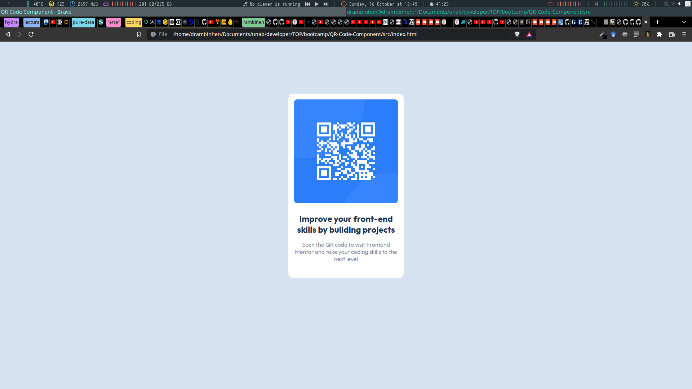

# Make It Real - QR CODE COMPONENT

This is a solution to the QR Code Component project of the Make It Real course.

## Table of contents

- [Overview](#overview)
  - [The challenge](#the-challenge)
  - [Screenshot](#screenshot)
- [My process](#my-process)
  - [Built with](#built-with)
  - [What I learned](#what-i-learned)
  - [Continued development](#continued-development)
  - [Useful resources](#useful-resources)
- [Author](#author)
- [Acknowledgments](#acknowledgments)

## Overview

### The challenge

Users should be able to:

- Develop mobile design 
- Develop desktop design

### Screenshot

## My process

### Built with

- Semantic HTML5 markup
- CSS custom properties
- Mobile-first workflow

### What I learned

Getting trust about css and responsive design

### Useful resources

- [Example resource 1](https://developer.mozilla.org/es/) - This helped me in terms of html tags.

## Author

daniel monsalve villegas

## Acknowledgments

Thansk Diana Quinche for your patience
